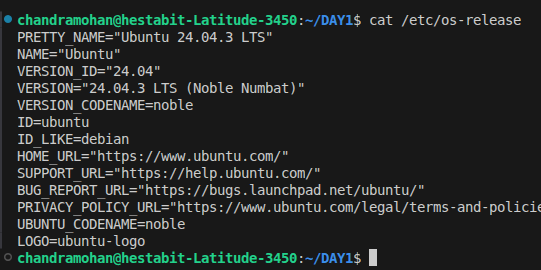
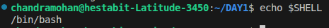
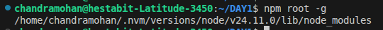
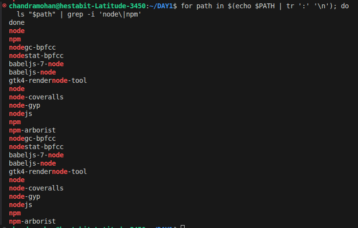
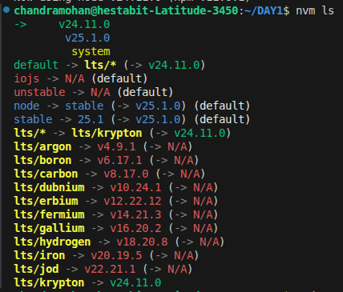
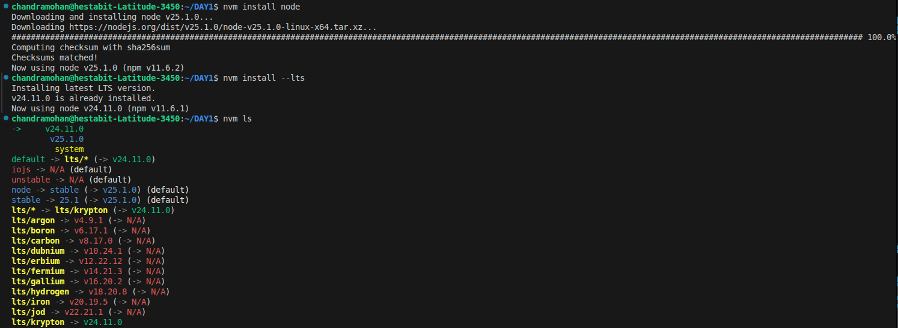

# Week 1 - Node.js and Terminal Mastering

## 📋 Table of Contents
- [1. System Identification](#1-system-identification)
- [2. Node.js and NVM](#2-nodejs-and-nvm)
- [3. introspect.js Script](#3-introspectjs-script)
- [4. STREAM vs BUFFER Exercise](#4-stream-vs-buffer-exercise)

---

## 1. System Identification

### 1.a. OS Version
**INPUT:** `cat /etc/os-release`

**NOTES:** `cat` displays file contents. `/etc/os-release` file stores OS info.

**RESULT:** VERSION="24.04.3 LTS (Noble Numbat)"

---

### 1.b. Current Shell
**INPUT:** `echo $SHELL`

**NOTES:** `echo` outputs variable value. `$SHELL` stores current shell path.

**RESULT:** Using Bash shell at /bin/bash



---

### 1.c. Node Binary Path
**INPUT:** `which node`

**NOTES:** `which` shows executable location.`node`nodejs runtime command

**RESULT:** /home/chandramohan/.nvm/versions/node/v24.11.0/bin/node

---

### 1.d. NPM Global Installation Path
**INPUT:** `npm root -g`

**NOTES:** `npm root -g` prints global packages directory.
`npm` → Node Package Manager (used to install, update, and manage Node.js packages).

`root` → A subcommand that shows the root directory where npm installs packages.

`-g (or --global)` → This flag tells npm to show the global installation directory instead of the local one`

**RESULT:** /home/chandramohan/.nvm/versions/node/v24.11.0/lib/node_modules

---

### 1.e. PATH Entries with Node or NPM
**INPUT:**
```bash
for path in $(echo $PATH | tr ':' '\n'); do
  ls "$path" | grep -i 'node\|npm'
done
```

**NOTES:** Loop breaks $PATH into directories and lists those containing node/npm executables.

**RESULT:** 


---

## 2. Node.js and NVM

### 2.a. Installed Node and NVM Versions
**INPUT:** `nvm ls`

**OUTPUT:**
```
->     v24.11.0
       v25.1.0
default -> lts/* (-> v24.11.0)
```

**NOTES:** `nvm ls` lists all installed Node.js versions and shows active one.

**RESULT:** Active: v24.11.0 (LTS Krypton), Installed: v24.11.0 and v25.1.0




---

### 2.b. Verify NVM Installation
**INPUT:** `command -v nvm`

**OUTPUT:** `nvm`

**NOTES:** Confirms NVM is installed and accessible.

**RESULT:** NVM is working correctly.


---

## 3. introspect.js Script

**Create file:** `nano introspect.js`

**Code:**
```javascript
const os = require('os');
const process = require('process');

console.log('OS:',os.type());
console.log('Architecture:',os.arch());
console.log('CPU Cores:',os.cpus() ,'\nAll CPU Cores:',os.cpus().length);
console.log('Total memory:',os.totalmem(),'Bytes');
console.log('System Uptime:', os.uptime(),'Seconds');
console.log('Current Logged User:',os.userInfo().username);
console.log('Node Path:',process.execPath);
```

**Save:** CTRL+O → Enter → CTRL+X

**Run:** `node introspect.js`

---

## 4. STREAM vs BUFFER Exercise

### Step A: Generate Test File
**INPUT:** `dd if=/dev/urandom of=largefile.txt bs=1M count=50`

**NOTES:** `dd(data duplicator)` copies data. `if=/dev/urandom` special file in Unix-like systems that provides random binary data (pseudo-random bytes). `bs=1M` sets 1MB blocks. `count=50` creates 50MB file.

---

### Step B: Create Benchmark Script

**Code:**
```javascript
const fs = require('fs');

const benchmarkReadFile = (callback) => {
  const startMemory = process.memoryUsage().rss;
  const start = Date.now();

  fs.readFile(filePath, (err, data) => {
    if (err) {
      console.error('Error reading file:', err);
      return;
    }

    const endMemory = process.memoryUsage().rss;
    const end = Date.now();

    results.readFile = {
      time: end - start,
      memory: endMemory - startMemory
    };
    console.log(
      `Buffer (fs.readFile): { executionTime: ${results.readFile.time} ms, memoryUsed: ${results.readFile.memory} bytes }`
    );

    callback();
  });
};

const benchmarkStreamFile = (callback) => {
  const startMemory = process.memoryUsage().rss;
  const start = Date.now();

  fs.createReadStream(filePath)
    .on('data', () => {}) // Consume data
    .on('end', () => {
      const endMemory = process.memoryUsage().rss;
      const end = Date.now();

      results.stream = {
        time: end - start,
        memory: endMemory - startMemory
      };
      console.log(
        `Buffer (fs.createReadStream): { executionTime: ${results.stream.time} ms, memoryUsed: ${results.stream.memory} bytes }`
      );

      callback();
    })
    .on('error', (err) => {
      console.error('Stream error:', err);
    });
};


readFileWithBuffer();
```

**Save:** Ctrl+O → Enter → Ctrl+X

**Run:** `node fileSystem.js`

---

### Explanation
**Buffer Method:** `fs.readFile` loads entire file into memory. Measures time and memory usage.

**Stream Method:** `fs.createReadStream` reads file in chunks (more memory-efficient). Measures time and memory.

**Output:** Both methods save results showing execution time and memory usage to `day-1-perf.json`.