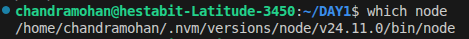

To_identify:
  1.a_OS_version:
    INPUT: |
      cat /etc/os-release
    OUTPUT: |
      
    NOTE: |
      cat is used to concatenate and display contents of a file.
      /etc/os-release is the system file that stores info about the OS.
    RESULT: |
      VERSION="24.04.3 LTS (Noble Numbat)" (Version + Codename)
  1.b_Current_shell:
    INPUT: |
      echo $SHELL
    OUTPUT: |
      
    NOTE: |
      echo outputs the value of a variable.
      $SHELL is a special environment variable that stores the path of the current shell.
    RESULT: |
      Using the Bash shell (located at /bin/bash)
  1.c_Node_binary_path:
    INPUT: |
      which node
    OUTPUT: |
      
    NOTE: |
      which tells location of the executable.
      node is the name of the Node.js executable.
    RESULT: |
      Node executable is located in the /home/chandramohan/.nvm/versions/node/v24.11.0/bin/ directory.
  1.d_NPM_global_installation_path:
    INPUT: |
      npm root -g
    OUTPUT: |
      
    NOTE: |
      npm is used to interact with the Node Package Manager.
      root -g tells npm to print the directory where global packages are installed.
    RESULT: |
      Global npm packages are installed in the /home/chandramohan/.nvm/versions/node/v24.11.0/lib/node_modules directory.
  1.e_PATH_entries_with_node_or_npm:
    INPUT: |
      for path in $(echo $PATH | tr ':' '\n'); do
        ls "$path" | grep -i 'node\|npm'
      done
    OUTPUT: |
      
    NOTE: |
      The loop breaks $PATH into directories and lists those containing node or npm executables.
      If nvm is not installed and Node.js/npm are not in PATH, no output would be printed.
    RESULT: |
      Multiple node-related binaries are found — main active version path is:
      /home/chandramohan/.nvm/versions/node/v24.11.0/bin/
  2.a._Installed_Node_and_NVM_versions:
    INPUT: |
      nvm ls
    OUTPUT: |
      ->     v24.11.0
             v25.1.0
      default -> lts/* (-> v24.11.0)
      node -> stable (-> v25.1.0) (default)
      lts/* -> lts/krypton (-> v24.11.0)
    NOTE: |
      nvm ls lists all installed Node.js versions and shows which one is currently active.
    RESULT: |
      Active Node.js version: v24.11.0 (LTS Krypton)
      Installed versions: v24.11.0 and v25.1.0
  2.b._Verify_NVM_installation:
    INPUT: |
      command -v nvm
    OUTPUT: |
      nvm
    NOTE: |
      This confirms that NVM is correctly installed and accessible from the terminal.
    RESULT: |
      NVM is installed and working correctly.

